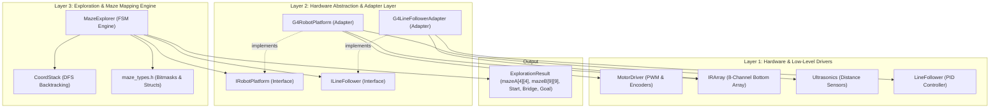

# Phase 1 Maze Exploration: Architecture & Team Integration Guide
**EE4360 MicroMouse Project — Group 4**

---

## 1. Executive Summary & Architectural Overview

The Phase 1 Maze Exploration system is designed using a **layered, decoupled architecture** adhering to the **Dependency Inversion Principle**. The core maze solving and mapping algorithms do not interact directly with hardware pins, motor registers, or raw analog-to-digital converter (ADC) channels.

Instead, the system is separated into three distinct layers:



### Why this design helps our team:
1. **Parallel Development:** Each team member can independently write, calibrate, and unit-test their hardware module (`MotorDriver`, `IRArray`, `Ultrasonic`, `LineFollower`) without breaking or needing to touch the exploration algorithm.
2. **Deterministic Simulation:** The algorithm has been verified on pure C++ native unit tests, Python headless scripts, and an interactive browser simulation with **100% mathematical certainty** before deploying to the physical robot.
3. **Pluggable Components:** If the line following controller or motor driver is refactored, only the adapter (`hardware_adapter.cpp`) needs minor updates; the entire maze mapping logic remains untouched.

---

## 2. Team Subsystem Mapping (How Each Part Contributes)

Every subsystem developed by group members maps directly into a specific function of the platform adapter:

| Team Subsystem / Module | Responsible Hardware | Role in the System | Platform Adapter Hook |
|---|---|---|---|
| **Motor Driver & Encoders** (`lib/MotorDriver`) | Dual H-Bridge (RPWM/LPWM), 2x Optical Encoders | Executes dead-reckoned forward cell motions (`25 cm`) and precise `90°` / `180°` in-place rotations. | `G4RobotPlatform::moveForwardOneCell()`, `G4RobotPlatform::turn(int)`, `G4RobotPlatform::stop()` |
| **IR Sensor Array** (`lib/IRArray`) | 8-Channel Bottom Phototransistor Array | Senses floor reflectivity. Differentiates normal black maze surface, full-white start/finish tiles, and the 9cm/3cm bridge optical marker. | `G4RobotPlatform::readFloorTile()`, `G4LineFollowerAdapter::step()` |
| **Ultrasonic Distance Sensors** (`lib/Ultrasonic`) | HC-SR04 / Ultrasonic Transceivers | Measures front wall clearance to detect presence of maze walls prior to moving forward. | `G4RobotPlatform::readWalls()` |
| **Line Follower** (`lib/LineFollower`) | Closed-loop PID controller with IRArray feedback | Autonomously steers the robot along the narrow white guidance line across the elevated bridge span. | `G4LineFollowerAdapter::begin()`, `G4LineFollowerAdapter::step()`, `G4LineFollowerAdapter::stop()` |

---

## 3. Input Specifications (What the Algorithm Expects)

The `MazeExplorer` algorithm queries inputs via the abstract [`IRobotPlatform`](../include/robot_hardware_interface.h) and [`ILineFollower`](../include/robot_hardware_interface.h) interfaces.

### Input 1: Wall Sensor Readings (`WallSensors`)
* **Provided by:** `IRobotPlatform::readWalls()`
* **Data Structure:**
  ```cpp
  struct WallSensors {
      bool wallFront; // true if obstacle detected within ~18 cm in front
      bool wallLeft;  // true if left wall detected
      bool wallRight; // true if right wall detected
  };
  ```
* **Orientation Semantics:** These booleans are **relative to the robot's current heading**. The algorithm automatically translates them to absolute cardinal directions (`NORTH`, `EAST`, `SOUTH`, `WEST`).

### Input 2: Floor Tile Classification (`TileType`)
* **Provided by:** `IRobotPlatform::readFloorTile()`
* **Enum Definition:**
  ```cpp
  enum TileType : uint8_t {
      TILE_NORMAL_BLACK  = 0, // Standard maze corridor floor
      TILE_WHITE         = 1, // Section A start tile OR Section B goal tile
      TILE_BRIDGE_MARKER = 2  // Tile immediately before the bridge ramp
  };
  ```
* **Detection Mechanism:**
  - `TILE_WHITE`: Detected when $\ge 7$ of the 8 bottom IR sensors read white (ADC value $<$ threshold).
  - `TILE_BRIDGE_MARKER`: Detected using a temporal state machine observing the sequence:
    $$\text{Black Floor} \longrightarrow \text{Outer White (9 cm)} \longrightarrow \text{Center Black (3 cm)} \longrightarrow \text{Outer White (9 cm)}$$

### Input 3: Motion Execution Status
* **Provided by:** `IRobotPlatform::moveForwardOneCell()`
* **Contract:** Returns `true` upon traveling exactly 288 encoder ticks ($25\text{ cm}$), or `false` if stalled.

### Input 4: Bridge Crossing Step Status
* **Provided by:** `ILineFollower::step()`
* **Contract:** Runs one cycle of PID motor updates. Returns `false` while still tracking across the bridge, and `true` when the line ends and all 8 IR sensors detect the normal black floor of Section B.

---

## 4. Output Specifications (What the Algorithm Produces)

Upon finishing exploration, the algorithm returns a populated `ExplorationResult` structure:

```cpp
struct ExplorationResult {
    uint8_t   mazeA[4][4];       // Normalized 4x4 wall bitmask matrix
    uint8_t   mazeB[9][9];       // Mapped 9x9 wall bitmask matrix
    CellCoord startA;            // Start tile coordinate in Section A (0..3, 0..3)
    CellCoord bridgeEntryA;      // Bridge entry ramp coordinate in Section A
    CellCoord bridgeExitB;       // Bridge exit coordinate in Section B (0, 0)
    CellCoord goalB;             // Goal tile coordinate in Section B
    bool      goalFound;         // true if Section B goal tile was identified
    bool      completed;         // true if entire exploration succeeded
};
```

### Wall Bitmask Encoding Scheme
Every cell in `mazeA[y][x]` and `mazeB[y][x]` is stored as a single `uint8_t` bitmask:

| Bit | Bitmask Constant | Hex Value | Meaning |
|---|---|---|---|
| Bit 0 | `WALL_NORTH` | `0x01` | Wall exists to the North ($+Y$) |
| Bit 1 | `WALL_EAST` | `0x02` | Wall exists to the East ($+X$) |
| Bit 2 | `WALL_SOUTH` | `0x04` | Wall exists to the South ($-Y$) |
| Bit 3 | `WALL_WEST` | `0x08` | Wall exists to the West ($-X$) |
| Bit 4 | `CELL_VISITED` | `0x10` | Cell has been physically visited and sensed |

*Example:* A cell with value `0x19` represents:
$$0\text{x}19 = 0\text{x}10\ (\text{VISITED}) + 0\text{x}08\ (\text{WEST WALL}) + 0\text{x}01\ (\text{NORTH WALL})$$

> **Phase 2 (Speed Run / Flood Fill) Consumption:**
> The speed-run algorithm only needs to inspect `result.mazeA` and `result.mazeB`. To check if movement from `(x, y)` in direction `dir` is possible:
> `bool canMove = !(maze[y][x] & WALL_MASKS[dir]);`

---

## 5. Maze Mapping Logic Deep-Dive

### 5.1 The Unknown Origin Challenge in Section A
* **Problem:** In Section A, the robot starts on a white tile whose coordinates `(a, b)` inside the $4\times 4$ arena are unknown beforehand.
* **Solution (Dynamic Bounding Box & Working Grid):**
  1. The algorithm initializes an expanded $7 \times 7$ internal working grid with the robot starting at center `(3, 3)`.
  2. As the robot traverses Section A, it tracks its minimum and maximum reached coordinates:
     $$[\min X, \max X] \quad \text{and} \quad [\min Y, \max Y]$$
  3. Bounding box constraints enforce that at any time:
     $$(\max X - \min X + 1) \le 4 \quad \text{and} \quad (\max Y - \min Y + 1) \le 4$$
     Any neighbor exceeding this 4-cell span is marked as a boundary wall.
  4. Once the bridge marker is located, `normalizeSectionA()` shifts the working grid so the lower-left corner becomes `(0, 0)`:
     $$\text{mazeA}[y][x] = \text{workGridA}[y + \min Y][x + \min X]$$
     $$\text{startA} = (3 - \min X, 3 - \min Y)$$

### 5.2 Symmetric Wall Propagation
Whenever a wall is sensed at cell $(x, y)$ in direction $d$, the algorithm not only records that wall in the current cell, but also sets the opposite wall mask in the adjacent neighboring cell:
$$\text{grid}[y + dy[d]][x + dx[d]] \mathrel{|}= \text{WALL\_MASKS}[(d + 2) \bmod 4]$$
This guarantees consistent wall data even if the robot never physically enters that neighbor.

### 5.3 DFS Backtracking Strategy
* Traversal follows a directional preference to minimize turning overhead:
  1. Straight ahead (`heading`)
  2. Right turn (`(heading + 1) % 4`)
  3. Left turn (`(heading + 3) % 4`)
  4. U-turn (`(heading + 2) % 4`)
* When an unvisited cell is chosen, the current coordinate is pushed onto `CoordStack`.
* When a dead-end is reached (all open neighbors are already visited), the robot pops the top coordinate from `CoordStack`, turns to face it, and drives backward along its trail.

---

## 6. Finite State Machine (Exploration Lifecycle)

```mermaid
stateDiagram-v2
    [*] --> STATE_INIT
    STATE_INIT --> STATE_EXPLORE_SECTION_A : begin()

    STATE_EXPLORE_SECTION_A --> STATE_APPROACH_BRIDGE : Bridge Marker Sensed (9cm white / 3cm black)
    STATE_APPROACH_BRIDGE --> STATE_CROSSING_BRIDGE : Move forward 1 cell onto bridge ramp
    
    STATE_CROSSING_BRIDGE --> STATE_ENTER_SECTION_B : LineFollower::step() signals end of bridge
    STATE_ENTER_SECTION_B --> STATE_EXPLORE_SECTION_B : Step into Section B at (0,0) heading North
    
    STATE_EXPLORE_SECTION_B --> STATE_COMPLETED : White Goal Tile Detected
    STATE_EXPLORE_SECTION_B --> STATE_FAILED : All cells exhausted, goal not found
```

---

## 7. Concrete Hardware Integration Code Examples

### How `main.cpp` glues everything together:

```cpp
// 1. Hardware Instantiation
MotorDriver motorDriver(PIN_LEFT_RPWM, PIN_LEFT_LPWM, PIN_RIGHT_RPWM, PIN_RIGHT_LPWM,
                        PIN_MOTOR_EN, PIN_LEFT_ENC_A, PIN_LEFT_ENC_B,
                        PIN_RIGHT_ENC_A, PIN_RIGHT_ENC_B);

IRArray irSensorArray(IR_PINS, PIN_IR_EN, NUM_IR_SENSORS);
Ultrasonics frontUltrasonic(PIN_ULTRA_TRIG, PIN_ULTRA_ECHO);
LineFollower lineFollower(motorDriver, irSensorArray);

// 2. Adapters Instantiation
G4RobotPlatform platform(motorDriver, irSensorArray, frontUltrasonic);
G4LineFollowerAdapter lineFollowerAdapter(lineFollower, irSensorArray);

// 3. Algorithm Engine Instantiation
MazeExplorer explorer(platform, &lineFollowerAdapter);

void setup() {
    Serial.begin(115200);
    // Calibration parameters
    irSensorArray.setThresholds(DEFAULT_IR_THRESHOLDS);
    lineFollower.begin(WHITE_VALUES, BLACK_VALUES);
    
    // Execute exploration
    ExplorationResult result = explorer.runExploration();
    printExplorationResults(result);
}
```

---

## 8. Calibration & Integration Checklist for Team Members

Before running on the physical arena, team members should verify their respective parameters in `include/config.h`:

### 1. Motor & Encoder Member:
- [ ] Measure ticks per cell: drive 25 cm, ensure `TICKS_PER_CELL_25CM` $\approx 288.0$.
- [ ] Verify 90-degree in-place turn: check `TICKS_PER_90_DEG` $\approx 116.5$.
- [ ] Ensure `motorDriver.stop()` cleanly brakes both motors without coasting.

### 2. IR Sensor Array Member:
- [ ] Place robot over pure white tile: verify all 8 sensors read $<$ `WHITE_VALUES`.
- [ ] Place robot over black corridor: verify all 8 sensors read $>$ `BLACK_VALUES`.
- [ ] Test the 9cm white / 3cm black optical marker sequence with `G4RobotPlatform::readFloorTile()`.

### 3. Ultrasonic Sensor Member:
- [ ] Measure distance to wall at cell center: ensure wall detection threshold is reliable ($\approx 18.0\text{ cm}$).
- [ ] Ensure timeout handling: sensor should return $-1.0\text{ cm}$ or $> 50\text{ cm}$ if no wall exists ahead.

### 4. Line Follower Member:
- [ ] Test bridge transition: robot drives along the ramp line and stops cleanly when encountering all-black floor.
- [ ] Verify safety timeout: `maxBridgeCrossTimeMs` (default $15000\text{ ms}$) prevents infinite stalls on the bridge.
